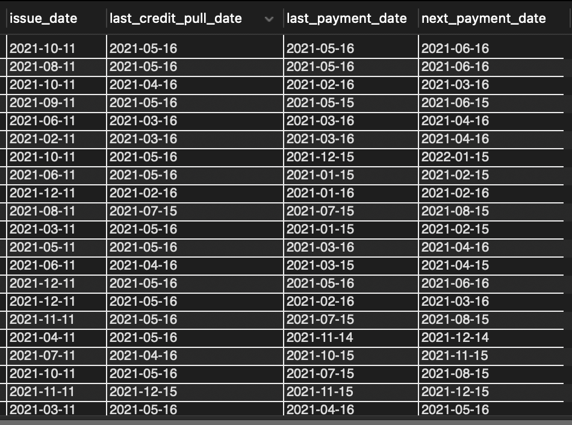

# Introduction
Bank loans are a crucial financial tool that enables individuals and businesses to achieve their goals and manage financial needs. This Bank Loan Dashboard is designed to monitor and evaluate the bank's lending processes. It serves as a tool to enhance data-driven decision-making, allowing for strategic planning in the lending operations of the bank.

## Repository content
The following files are included in this repository:
* Dashboard (bank_loan_analysis__73207.twbr)
* SQL queries performed in the analysis (loan_analysis.sql)
* Dataset (bank_loan_queried.xls)

Explore the interactive dashboard on my Tableau Public profile:  
https://public.tableau.com/app/profile/bay.yang.jie/viz/bank_loan_analysis_17373723293010/Summary

## Implementation 
The project involved loading the dataset from MS SQL into Tableau. The dashboards were created using Tableau's visualization tools, adhering to the requirements outlined in the problem statement and leveraging the data dictionary for accurate field usage

Direct queries were ran against the MySQL database to fetch raw data. This data served as a benchmark to validate the data presented in the dashboards. Similarly, transformations in Tableau such as the aggregating, filtering were verified against the raw data queried using MySQL.

Through these validation steps, the project ensured that the dashboards accurately represent the data and the insights derived are based on truthful and unaltered information. This rigorous validation process enhances the credibility of the dashboards and reinforces confidence in the data-driven decisions made using these tools.

### Data Cleaning
The main data cleaning step involved converting the format of the date variables to the SQL default date format (YYYY/MM/DD). The date values initially comprised of a mix of different date formats which can lead to errors when utilizing these fields espeically for time series analysis. Thus, the date format was aligned to use the default MySQL date format for easier interpretation.

Before:  

After:  

# Overview
Overview of Dashboards created:
- Summary
- Overview
- Details

The report comprises of three dynamic dashboards namely the Summary, Overview and Details as shown above.  The dashboards conduct a deep dive into the bank's loan activities through analysis of various metrics for gaining a deeper understanding of the overall health of the bank's loan portfolio.

## Dashboard #1 - Summary
The summary dashboard provides a snapshot of **crucial metrics** used in this analysis such as Total Loan Applications, Total Funded Amount, Total Amount Received, Average Interest Rate and Average Debt-to-Income Ratio (DTI). The performance of these metrics are measured on a Month-To-Date (MTD) and Month-On-Month (MoM) basis.

### Key Performance Indicators (KPIs) Requirements

1. **Total Loan Applications**: Calculates the total number of loan applications received during a specified period. Additionally, it is essential to monitor the Month-to-Date (MTD) Loan Applications and track changes Month-over-Month (MoM).

2. **Total Funded Amount**: Understanding the total amount of funds disbursed as loans is crucial. We also want to monitor the MTD Total Funded Amount and analyse the Month-over-Month (MoM) changes in this metric.

3. **Total Amount Received**: Tracking the total amount received from borrowers is essential for assessing the bank's cash flow and loan repayment. We should analyse the Month-to-Date (MTD) Total Amount Received and observe the Month-over-Month (MoM) changes.

4. **Average Interest Rate**: Calculating the average interest rate across all loans, MTD, and monitoring the Month-over-Month (MoM) variations in interest rates will provide insights into the lending portfolio's overall cost.

5. **Average Debt-to-Income Ratio (DTI)**: Evaluating the average DTI for borrowers helps to gauge overall financial health. We need to compute the average DTI for all loans, MTD, and track Month-over-Month (MoM) fluctuations.

### Good Loan v Bad Loan KPI’s

In order to better evaluate the performance of lending activities and the quality of the loan portfolio, the data is further broken down to understand the performance of both Good and Bad Loans based on the metrics mentioned previously.

#### Good Loan KPIs

1. **Good Loan Application Percentage**: We need to calculate the percentage of loan applications classified as 'Good Loans.' This category includes loans with a loan status of 'Fully Paid' and 'Current.'

2. **Good Loan Applications**: Identifying the total number of loan applications falling under the 'Good Loan' category, which consists of loans with a loan status of 'Fully Paid' and 'Current'

3. **Good Loan Funded Amount**: Determining the total amount of funds disbursed as 'Good Loans.' This includes the principal amounts of loans with a loan status of 'Fully Paid' and 'Current'

4. **Good Loan Total Received Amount**: Tracking the total amount received from borrowers for 'Good Loans' , which encompasses all payments made on loans with a loan status of 'Fully Paid' and 'Current'

#### Bad Loan KPIs
  
1. **Bad Loan Application Percentage**: Calculating the percentage of loan applications categorized as 'Bad Loans' . This category specifically includes loans with a loan status of 'Charged Off'.

2. **Bad Loan Applications**: Identifying the total number of loan applications categorized as 'Bad Loans' , which consists of loans with a loan status of 'Charged Off'.

3. **Bad Loan Funded Amount**: Determining the total amount of funds disbursed as 'Bad Loans'. This comprises the principal amounts of loans with a loan status of 'Charged Off'.

4. **Bad Loan Total Received Amount**: Tracking the total amount received from borrowers/repayed for 'Bad Loans' which includes all payments made on loans with a loan status of 'Charged Off'.

### Loan Status Grid View

In order to gain a comprehensive overview of the lending operations and monitor the performance of loans, we aim to create a grid view report categorized by 'Loan Status'. This report will serve as a valuable tool for analysing and understanding the key indicators associated with different loan statuses. By providing insights into metrics such as 'Total Loan Applications', 'Total Funded Amount', 'Total Amount Received', 'Month-to-Date (MTD) Funded Amount', 'MTD Amount Received', 'Average Interest Rate' and 'Average Debt-to-Income Ratio (DTI)', this grid view helps to drive data-driven decisions and assess the overall health of the loan portfolio.

## Dashboard #2 - Overview
The Overview Dashboard aids in identifying trends, seasonal patterns and the distribution of loans across various categories like Employment lengths of borrowers, Loan purpose, Number of applications of each loan type and Home ownership types of borrowers.

The aim of this dashboard is to visually represent critical loan-related metrics and trends using a variety of chart types. These charts will provide a clear and insightful view of our lending operations, facilitating data-driven decision-making and enabling us to gain valuable insights into various loan parameters.

1. Monthly Trends by Issue Date (Line Chart):
Objective: This line chart showcases how 'Total Loan Applications,' 'Total Funded Amount,' and 'Total Amount Received' vary over time, allowing us to identify seasonality and long-term trends in lending activities.

2. Regional Analysis by State (Filled Map):
This filled map will visually represent lending metrics categorized by state, enabling us to identify regions with significant lending activity and assess regional disparities.

3. Loan Term Analysis (Donut Chart):
This donut chart depicts loan statistics based on different loan terms, allowing us to understand the distribution of loans across various term lengths.

4. Employee Length Analysis (Bar Chart):
This bar chart illustrates how lending metrics are distributed among borrowers with different employment lengths, helping us assess the impact of employment history on loan applications.

5. Loan Purpose Breakdown (Bar Chart):
This bar chart provides a visual breakdown of loan metrics based on the stated purposes of loans, aiding in the understanding of the primary reasons borrowers seek financing.

6. Home Ownership Analysis (Tree Map):
This tree map displays loan metrics categorized by different home ownership statuses providing a hierarchical view of how home ownership impacts loan applications and disbursements.

## Dashboard #3 - Details
The Details Dashboard offers a detailed view of the loan data, providing a comprehensive and user-friendly interface for accessing vital loan metrics, borrower profiles, and performance data.

The primary objective of the Details Dashboard is to provide a comprehensive and user-friendly interface for accessing vital loan data. It will serve as a one-stop solution for users seeking detailed insights into our loan portfolio, borrower profiles, and loan performance.

# Conclusion
With the inclusion of the robust data validation techniques employed in this analysis, the Bank Loan Dashboard would serve as a reliable and authoritative source for monitoring the bank’s loan activities and portfolio health. The project not only presents critical data through intuitive visualizations but also guarantees the precision of the information displayed, enabling the bank to make informed and assured strategic decisions.
